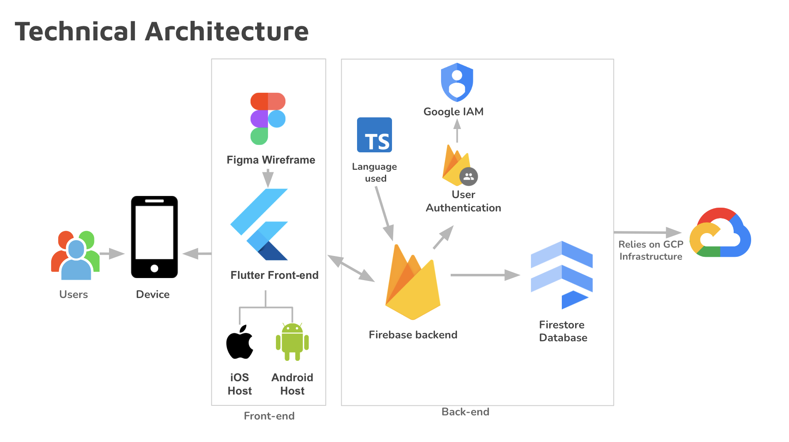

# Project Information

## Project Goal
Kaleidoscope Collaborative aims to address the challenge faced by individuals with disabilities, as well as their caregivers and advocates, in finding and sharing information about nearby locations with appropriate disability accommodations, ultimately enhancing accessibility and inclusivity within their communities.

## Client
- Patrinia Baksmaty (Founder & CEO of Kaleidoscope Collaborative)

## Developer Team
- Anargh Sidhardhan (Boston University)
- Revathi Vipinachandran (Boston University)
- JingHong Huang (Boston University)

# Technical Architecture 

our tech stack: 
- Flutter + dart
- Firebase backend
- Firestore: data storage
     - link: https://console.firebase.google.com/u/0/project/se-kaleidoscope-collaborative 
- Express.js for Google API routing
- Deployment: GCP deployment as most of our tech stack revolves around Google Infrastructure
- State: Provider, which has not been integrated 
- Development Emulator: IOS emulator (preferred as the backend code is written for IOS emulator, for android emulator, please change the localhost to 10.0.2.2:8000 in backend/address.ts) 

# Features

- User Registration
- User Verification
- User Login
- Landing Page
- Explore Page
- Rating Card
- Add a Review
- Accommodations Based Reviews
- Search and Filter

# How to Run the Project 
- Please follow through with the installations for Flutter as well as the remote devices needed for displaying the Flutter environment
- MAKE SURE TO USE FLUTTER VERSION 3.13.3 so that the Buttons will function properly.
- Make sure to run the backend express.js with your OWN Google API key, specific instructions are in the backend document, in address.ts. Make sure to run the requirements.txt installation beforehand.
- To run the flutter development, make sure to start the remote device, and use the command: **flutter run lib/screens/main.dart **

# Bugs We Have Encountered 

1. NODES MODULES ERROR:
    - please run **npm i** to install the necessary node packages, as well as the ones in requirements.txt
3. NO SUCH METHOD ERROR for page loading: this comes when there are too many flutter runs 
    - flutter clean
    - flutter pub get
    - flutter run   
3. Running backend giving "Error: ClientException with SocketException: Connection refused (OS error 111)" with android emulator 
    - This is caused by android emulator not being able to connect to localhost. To fix this, you need to run the backend on a different port: 10.0.2.2:8000 (instead of localhost:3000, which works for iOS emulator)

# Future Scope

- Inclusion of Organizations as Users

One of the primary directions for expanding our application's capabilities involves integrating organizations as active users. This enhancement will empower various establishments to directly contribute to our database by adding their own information, particularly in terms of the disability accommodations they offer. By doing so, organizations can significantly enhance their visibility within the community, demonstrating their commitment to inclusivity and accessibility.

- Administrative Roles for In-App Management

Administrators, designated from within the user community or partner organizations, will be empowered to manage the exhaustive list of accommodations. They will have the capability to update, add, or remove entries as needed, ensuring the database remains current and relevant. This approach not only streamlines the process of keeping the database updated but also opens up opportunities for the database to grow organically, driven by community input and real-time needs.

# How to Contribute

Thank you for your interest in contributing to the Kaleidoscope Collaborative Project! To contribute, please follow the steps below:

1. **Fork the Repository**: Click on the "Fork" button in the top-right corner of this page to create a copy of the repository under your GitHub account.

2. **Clone the Repository**: Open your terminal or Git Bash and run the following command to clone the repository to your local machine:

3. **Create a Branch**: Change into the project directory using the `cd se-kaleidoscope-collaborative` command. Create a new branch with a descriptive name for your feature:

4. **Make Changes and Commit**: Open the project in your preferred code editor. Make the necessary changes to the codebase. Save your changes and go back to the terminal. Stage the modified files using `git add .`, and then commit the changes with a descriptive message using `git commit -m "Add a concise commit message here"`.

5. **Push Changes**: Push the changes to your forked repository:

6. **Create a Pull Request**: Go to the [Pull requests](https://github.com/BU-Spark/se-kaleidoscope-collaborative/pulls) tab of the original repository. Click on the "New pull request" button. Select the base repository and branch (usually the main branch of the original repository). Select your forked repository and the branch with your changes. Add a descriptive title and comment explaining your changes. Click on the "Create pull request" button to submit your pull request.

7. **Collaborate and Iterate**: Wait for the repository owners or maintainers to review your pull request. Make any necessary changes or address any feedback requested. Once approved, the changes will be merged into the main repository.

We appreciate your contributions to the Kaleidoscope Collaborative Project. Thank you for helping us make a difference!

# Test Cases and Security 

This is the first integration of the project implementation, we have not yet implemented any security measurements and test cases. The future teams should take action wherever necessary to implement test cases that are suitable for the frontend and backend architecture. 

# Deployment 
As of now, we have not deployed the project. The future teams should take action to deploy the project on GCP or AWS or any other cloud platform that is suitable for the project. 

